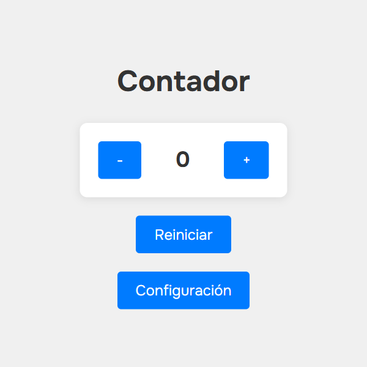

# 🔢 Contador Interactivo

Un contador avanzado desarrollado con HTML, CSS y JavaScript vanilla. Este es el **Proyecto #4** de mi serie de proyectos de desarrollo web.

## 📋 Descripción

Aplicación de contador con funcionalidades avanzadas que permite incrementar, decrementar y reiniciar valores. Incluye configuración personalizable con límites superior/inferior, paso personalizado y persistencia de datos usando localStorage.

## ✨ Características Implementadas

- **Botones de control:** Aumentar (+), disminuir (-) y reiniciar
- **Configuración avanzada:** Dialog modal para personalizar parámetros
- **Límites personalizables:** Valor mínimo y máximo configurable
- **Paso personalizable:** Incremento/decremento por pasos definidos
- **Persistencia de datos:** Guarda contador y configuración en localStorage
- **Validación inteligente:** Respeta límites automáticamente
- **Interfaz moderna:** Dialog nativo con backdrop blur
- **Efectos visuales:** Transiciones suaves y hover effects
- **Diseño responsivo:** Centrado y adaptable
- **Configuración persistente:** Mantiene ajustes entre sesiones

## 🛠️ Tecnologías Utilizadas

- **HTML5:** Estructura semántica moderna con:
  - Dialog element nativo
  - Formularios accesibles con validación
  - Meta tags optimizados
- **CSS3:** Estilos avanzados con:
  - Flexbox para layouts centrados
  - CSS Nesting (sintaxis moderna)
  - Transiciones y transformaciones
  - Dialog styling con backdrop
  - Starting-style para animaciones
- **JavaScript ES6+:** Lógica avanzada con:
  - Destructuring assignment
  - Event listeners modernos
  - localStorage API
  - Validación de datos
  - State management
  - Math.min/max para límites
- **Google Fonts:** Tipografía Onest (100-900 weights)

## 🎨 Diseño y Estilo

### Paleta de Colores

```css
/* Tema limpio y profesional */
--bg-primary: #f0f0f0; /* Fondo de página */
--bg-counter: #ffffff; /* Fondo del contador */
--text-primary: #333; /* Texto principal */
--btn-primary: #007bff; /* Botones principales */
--btn-hover: #0056b3; /* Botones en hover */
--shadow: rgba(0, 0, 0, 0.1); /* Sombras suaves */
--backdrop: rgba(0, 0, 0, 0.3); /* Backdrop del modal */
```

### Efectos Especiales

- **Box-shadow elevado** en contenedor principal
- **Transform scale** en hover de botones (1.05x)
- **Dialog con backdrop** nativo y animaciones
- **Starting-style transitions** para modal
- **Input focus effects** con transform y outline

## 📱 Diseño Responsivo

### Características

- **Flexbox centering:** Centrado perfecto vertical y horizontal
- **Contenedor máximo:** 800px con padding adaptable
- **Layout en columna:** Elementos apilados con gap consistente
- **Modal responsive:** Dialog centrado automáticamente

## 📂 Estructura del Proyecto

```
04-contador/
├── index.html              # Página principal
├── styles.css              # Estilos CSS
├── script.js               # Lógica JavaScript
├── screenshots/            # Capturas de pantalla
│   └── app-view.png        # Vista de la aplicación
└── README.md              # Documentación
```

## 🚀 Instalación y Uso

### Clonar el repositorio

```bash
git clone https://github.com/Zero-Fhx/04-contador.git
cd 04-contador
```

### Ejecutar el proyecto

1. **Método simple:** Abre `index.html` directamente en tu navegador
2. **Con Live Server (recomendado):**
   - Instala Live Server en VS Code
   - Click derecho en `index.html` → "Open with Live Server"
3. **Servidor local:**

   ```bash
   # Con Python 3
   python -m http.server 8000

   # Con Node.js (http-server)
   npx http-server
   ```

## ✅ Requisitos Cumplidos

Este proyecto incluye todas las características esenciales de un contador:

- [x] Botón aumentar, disminuir, resetear
- [x] Límite superior/inferior configurable
- [x] Interacción fluida con efectos visuales
- [x] Configuración persistente
- [x] Validación de entrada
- [x] Paso personalizable
- [x] Interfaz moderna y profesional

## 🌐 Demo en Vivo

🔗 **[Ver Demo](https://zero-fhx.github.io/04-contador/)** (GitHub Pages)

## 📸 Captura de Pantalla



## 🔧 Características Técnicas Destacadas

### Estado y Persistencia

```javascript
let data = {
  count: 0,
  settings: {
    step: 1,
    min: 0,
    max: 100
  }
}

function syncStateToStorage () {
  data.count = count
  data.settings.step = step
  data.settings.min = min
  data.settings.max = max
  localStorage.setItem('counterData', JSON.stringify(data))
}
```

### Límites Inteligentes

```javascript
decreaseButton.addEventListener('click', () => {
  count = Math.max(min, count - step)
  updateDisplay()
  syncStateToStorage()
})

increaseButton.addEventListener('click', () => {
  count = Math.min(max, count + step)
  updateDisplay()
  syncStateToStorage()
})
```

### Validación de Configuración

```javascript
if (
  isNaN(newStep) ||
  isNaN(newMin) ||
  isNaN(newMax) ||
  newStep <= 0 ||
  newMin >= newMax
) {
  alert('Por favor, ingresa valores válidos.')
  return
}
```

### Dialog Moderno con CSS

```css
.settings-dialog {
  inset: 0;
  margin: auto;
  background-color: #fff;
  border: none;
  transition: all 0.3s ease allow-discrete;
  opacity: 0;

  &[open] {
    opacity: 1;

    @starting-style {
      opacity: 0;
    }
  }

  &::backdrop {
    background-color: rgba(0, 0, 0, 0.3);
    transition: opacity 0.3s ease;
  }
}
```

### CSS Nesting Moderno

```css
button {
  background-color: #007bff;
  transition: all 0.3s ease;

  &:hover {
    background-color: #0056b3;
    transform: scale(1.05);
  }
}
```

## ⚙️ Configuración Disponible

| Parámetro  | Descripción                    | Valor por defecto |
| ---------- | ------------------------------ | ----------------- |
| **Paso**   | Incremento/decremento por clic | 1                 |
| **Mínimo** | Valor mínimo permitido         | 0                 |
| **Máximo** | Valor máximo permitido         | 100               |

### Controles

- **Guardar:** Aplica la nueva configuración
- **Restablecer:** Vuelve a valores por defecto
- **Cerrar:** Cierra sin guardar cambios

## 🔮 Futuras Mejoras

- [ ] **Animaciones de números** al cambiar valor
- [ ] **Temas personalizables** (claro/oscuro)
- [ ] **Múltiples contadores** en la misma página
- [ ] **Histórico de valores** con gráfico
- [ ] **Atajos de teclado** (flechas arriba/abajo)
- [ ] **Sonidos de feedback** opcionales
- [ ] **Exportar configuración** como JSON
- [ ] **Presets de configuración** guardados
- [ ] **Contador con decimales** opcionales
- [ ] **Temporizador automático** de incremento

## 📝 Lecciones Aprendidas

### JavaScript Moderno

- **Destructuring assignment** para extraer propiedades
- **Math.min/max** para aplicar límites elegantemente
- **localStorage** para persistencia compleja de objetos
- **Event handling** con múltiples elementos
- **Validation patterns** para entrada de usuario

### Gestión de Estado

- **Estado centralizado** con objeto de datos
- **Sincronización automática** con localStorage
- **Separación de concerns** entre UI y lógica
- **Inmutabilidad parcial** en actualizaciones

### CSS Avanzado

- **CSS Nesting** para código más limpio
- **Dialog element** nativo del navegador
- **Starting-style** para animaciones de entrada
- **Modern transitions** con allow-discrete

### UX/UI Design

- **Modal patterns** con backdrop nativo
- **Form validation** con feedback inmediato
- **Persistent settings** para mejor UX
- **Consistent spacing** con flexbox gap

## 🤝 Contribuciones

Este es un proyecto personal de aprendizaje, pero si encuentras mejoras o tienes sugerencias:

1. Fork el repositorio
2. Crea una rama para tu feature (`git checkout -b feature/mejora`)
3. Commit tus cambios (`git commit -m 'Añadir mejora'`)
4. Push a la rama (`git push origin feature/mejora`)
5. Abre un Pull Request

## 👨‍💻 Autor

**Erick Obed Flores Ricra**

- 🐙 GitHub: [@Zero-Fhx](https://github.com/Zero-Fhx)
- 💼 LinkedIn: [Erick Obed Flores Ricra](https://www.linkedin.com/in/erick-obed-flores-ricra-14a121280)
- 📧 Email: erickflores170404@gmail.com

---

**🤖 Desarrollo Asistido por IA:** Este proyecto fue desarrollado con la asistencia de inteligencia artificial para la búsqueda de información, resolución de problemas técnicos, optimización de código, consulta de conceptos desconocidos y creación de esta documentación.
